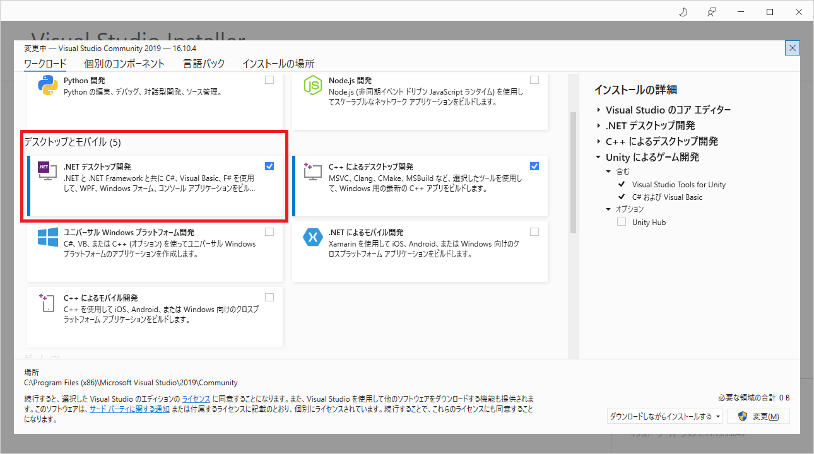
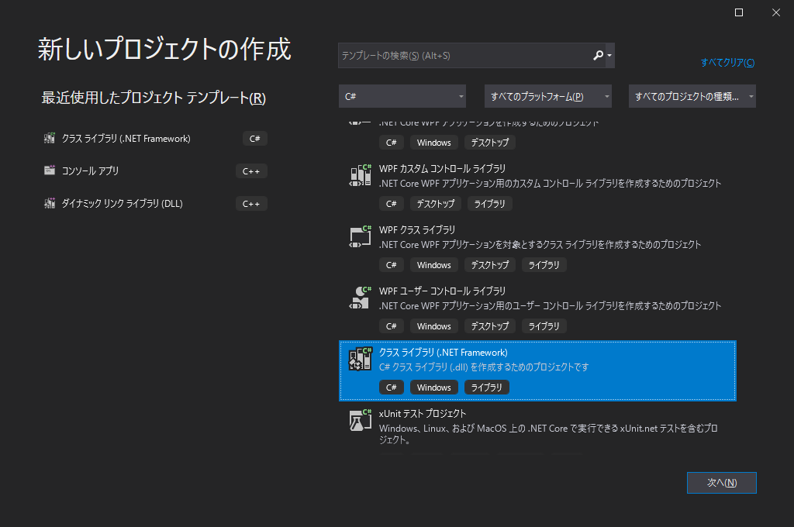
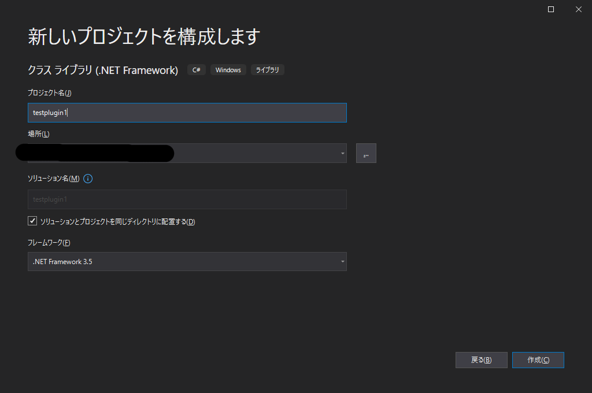
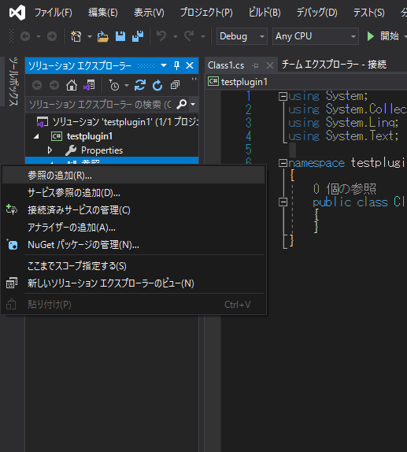
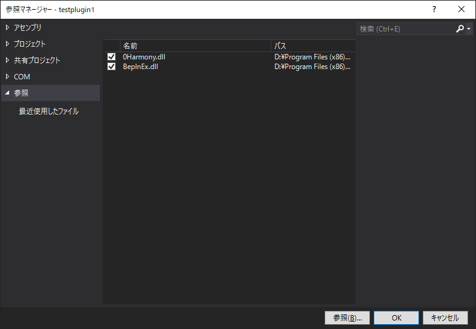
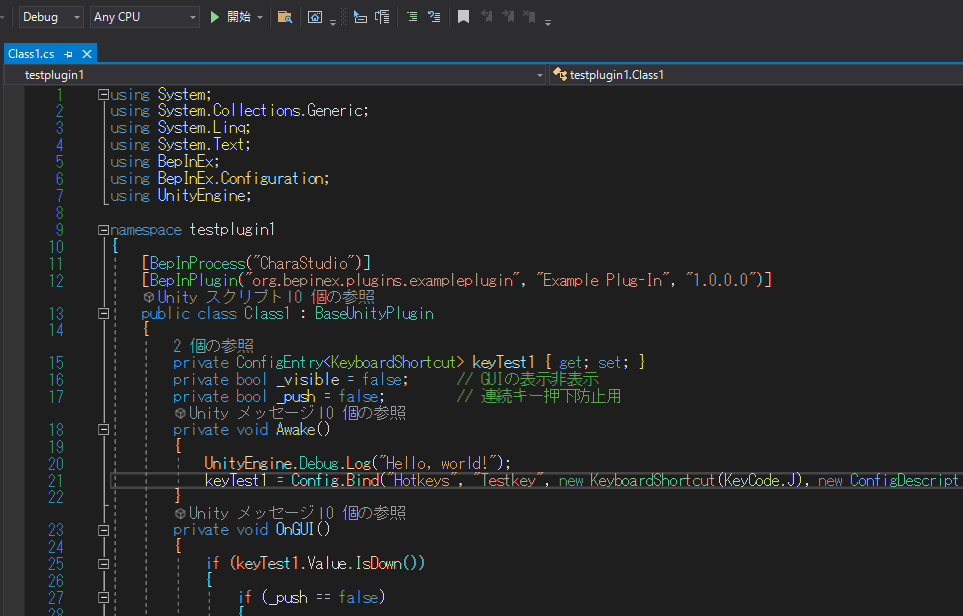
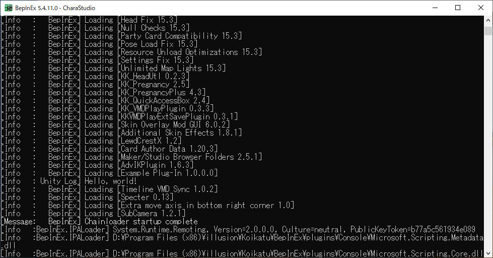
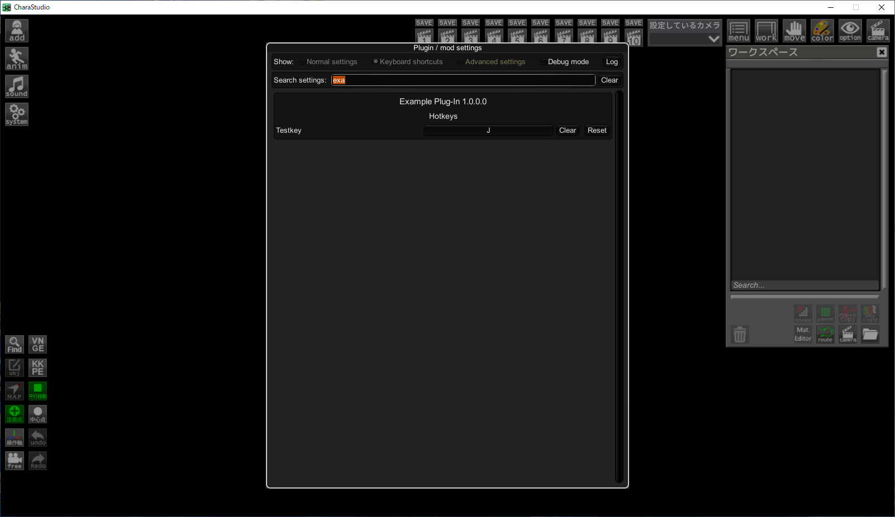
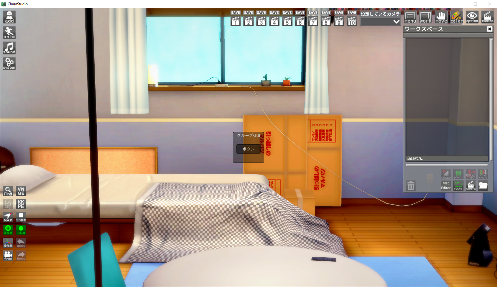

# コイカツのプラグイン作成（入門）
## - VisualStudioの進め方 ～ [HelloWorld]と[キー設定]
 
[本家BepInExチュートリアル](https://docs.bepinex.dev/articles/dev_guide/plugin_tutorial/) 
[BepInExAPI](https://docs.bepinex.dev/api/index.html)

### 1. Visual Studio Installerから「.NETデスクトップ開発」をインストールしておく

### 2.クラスライブラリ(.NET Framework)のプロジェクトを作成

### 3.フレームワークは「.NET Framework3.5」を指定 
(3.5以外だとBepInExクラスの使用で問題があった、要注意)

### 4.ソリューションエクスプローラーから参照の追加

### 5.「0Harmony」「BepInEx」「UnityEngine」を追加

### 6.ソースコード記述（Class1.cs）

### 7.ビルドして出来たdllをplugins配下へ、そして実行
デバック画面のプラグインの名前の下に「Hello,world」のメッセージを確認

F1からプラグイン設定画面を表示し、登録されていることを確認

 
実際に実行して確認

「補足」 
スタジオを実行したらBepInEx/config配下に設定ファイルが作成される。 
ボタン配置の変更のみだと更新されない？可能性あり。 

以上！
